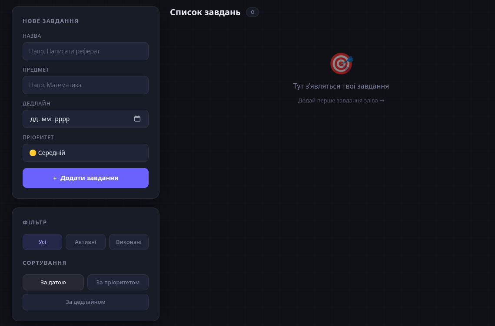

# Study Planner

Language: **English** | [Українська](README.ua.md)

## Screenshot



If the screenshot is not visible yet, add the site image as `docs/screenshot.png`.

## Overview

Study Planner is a SvelteKit application for organizing study tasks. It lets users add assignments, set subjects and deadlines, mark tasks as completed, filter by status, sort by priority or deadline, and track progress through simple statistics.

Tasks are stored locally in the browser using `localStorage`, so no backend is required.

## Features

- Add study tasks with title, subject, deadline, and priority.
- Mark tasks as completed or restore them.
- Delete tasks.
- Filter tasks by all, active, or completed.
- Sort tasks by creation date, priority, or deadline.
- Highlight overdue active tasks.
- Show total, completed, active, and progress percentage stats.
- Responsive layout for desktop and mobile.

## Tech Stack

- SvelteKit
- Svelte 5
- TypeScript
- Tailwind CSS 4
- Vite
- ESLint
- Prettier

## Getting Started

Install dependencies:

```bash
npm install
```

Start the development server:

```bash
npm run dev
```

Build for production:

```bash
npm run build
```

Preview the production build locally:

```bash
npm run preview
```

## Available Scripts

- `npm run dev`: start the local development server.
- `npm run build`: create a production build.
- `npm run preview`: preview the production build locally.
- `npm run check`: run SvelteKit sync and Svelte diagnostics.
- `npm run check:watch`: run diagnostics in watch mode.
- `npm run lint`: check formatting and lint the project.
- `npm run format`: format files with Prettier.

## Project Structure

```text
src/
  lib/
    components/
      PageHeader.svelte
      TaskCard.svelte
      TaskFilters.svelte
      TaskForm.svelte
      TaskList.svelte
      TaskStats.svelte
    styles.ts
    types.ts
  routes/
    +layout.svelte
    +page.svelte
  app.css
```

## Data Storage

Tasks are stored in browser `localStorage` under the key `study-planner-tasks`.

Because the app uses local browser storage, data is specific to the current browser and device. Clearing site data or using another browser will not preserve tasks.

## Quality Checks

Before committing changes, run:

```bash
npm run check
npm run lint
npm run build
```

## License

This project is licensed under the MIT License. See [LICENSE](LICENSE).

## Third-Party Libraries

Direct third-party dependencies are listed in [THIRD_PARTY_LIBRARIES.md](THIRD_PARTY_LIBRARIES.md).
